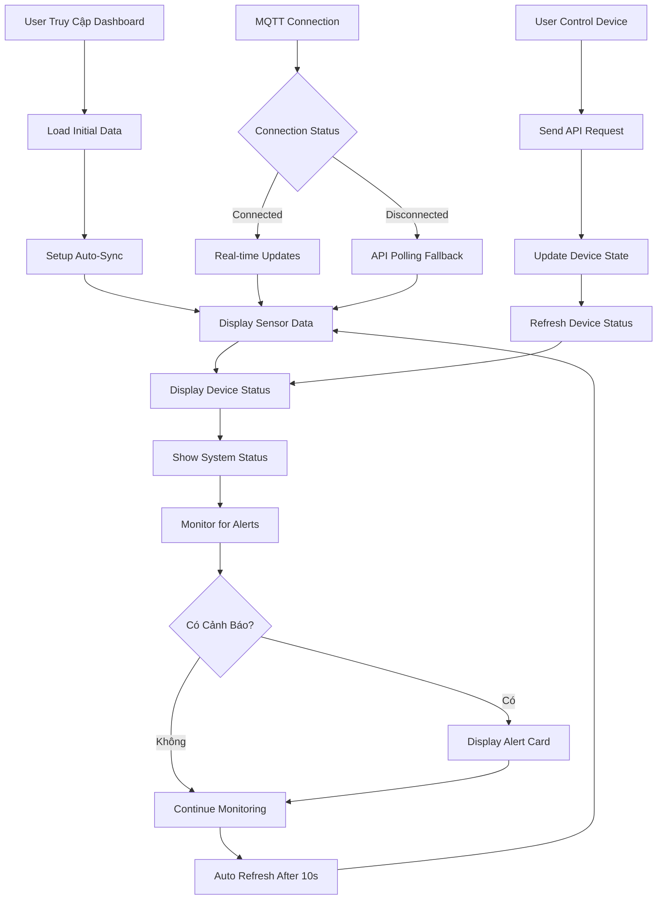

# Dashboard - Tổng Quan Hệ Thống

## 🎯 Chức Năng

Dashboard là trang chính của hệ thống GreenMind, cung cấp **cái nhìn tổng quan toàn diện** về tình trạng hoạt động của nhà kính thông minh. Đây là trung tâm điều khiển chính giúp người dùng giám sát và quản lý hệ thống một cách hiệu quả.

## 🌟 Lợi Ích Mang Lại

### 1. **Giám Sát Thời Gian Thực**
- Theo dõi các thông số môi trường liên tục 24/7
- Cập nhật dữ liệu tự động mỗi 10 giây
- Hiển thị xu hướng biến đổi qua biểu đồ gauge trực quan

### 2. **Quản Lý Thiết Bị Tập Trung**
- Điều khiển tất cả thiết bị từ một giao diện duy nhất
- Xem trạng thái hoạt động của từng thiết bị
- Thao tác nhanh chóng với các nút điều khiển

### 3. **Cảnh Báo Thông Minh**
- Phát hiện sớm các bất thường trong hệ thống
- Thông báo kịp thời khi vượt ngưỡng an toàn
- Phân loại mức độ cảnh báo (Thấp, Trung bình, Cao)

### 4. **Thống Kê Hệ Thống**
- Theo dõi hiệu suất hoạt động
- Kiểm tra tình trạng kết nối MQTT
- Giám sát cache và scheduler status

## 📊 Luồng Hoạt Động



## 🔧 Các Thành Phần Chính

### 1. **System Status Card**
```typescript
interface SystemStatusData {
  lastUpdate: string;           // Thời gian cập nhật cuối
  isLoading: boolean;          // Trạng thái loading
  schedulerRunning: boolean;   // Scheduler có đang chạy
  cacheStatus: {
    total_items: number;       // Tổng số items trong cache
    active_items: number;      // Số items đang active
  }
}
```

**Chức năng:**
- Hiển thị thời gian đồng bộ dữ liệu gần nhất
- Kiểm tra tình trạng background scheduler
- Theo dõi hiệu suất cache system

### 2. **Sensor Gauge Cards**
```typescript
interface SensorData {
  temperature: number | null;   // Nhiệt độ (°C)
  humidity: number | null;      // Độ ẩm không khí (%)
  soil: number | null;          // Độ ẩm đất (%)
  light: number | null;         // Cường độ ánh sáng (lux)
}
```

**Chức năng:**
- Hiển thị dữ liệu sensor dưới dạng gauge chart
- Cảnh báo màu sắc khi vượt ngưỡng
- Đơn vị đo và phạm vi giá trị rõ ràng

### 3. **Device Control Cards**
```typescript
interface DeviceState {
  id: string;                   // ID thiết bị
  name: string;                 // Tên hiển thị
  status: 'ON' | 'OFF';        // Trạng thái hiện tại
  lastUpdated: string;         // Thời gian cập nhật cuối
  isControlling: boolean;      // Đang trong quá trình điều khiển
}
```

**Thiết bị được hỗ trợ:**
- **Quạt thông gió**: Điều khiển lưu thông không khí
- **Bơm nước**: Quản lý tưới tiêu tự động
- **Mái che**: Điều chỉnh cường độ ánh sáng

### 4. **Alert Monitoring System**
```typescript
interface AlertData {
  id: string;
  type: 'warning' | 'critical' | 'info';
  severity: 'low' | 'medium' | 'high';
  title: string;
  message: string;
  timestamp: string;
  acknowledged: boolean;
}
```

**Loại cảnh báo:**
- **Nhiệt độ**: Quá cao/thấp (< 15°C hoặc > 35°C)
- **Độ ẩm**: Không phù hợp (< 40% hoặc > 80%)
- **Độ ẩm đất**: Thiếu/thừa nước (< 30% hoặc > 90%)
- **Hệ thống**: Mất kết nối, lỗi thiết bị

## 🔄 Tích Hợp Và Đồng Bộ

### Data Synchronization Strategy

```typescript
// Chiến lược đồng bộ dữ liệu
const syncStrategy = {
  // MQTT real-time (ưu tiên)
  mqtt: {
    enabled: mqttStatus,
    interval: 'real-time',
    reliability: 'high'
  },
  
  // API polling (fallback)
  api: {
    enabled: true,
    interval: 10000, // 10 giây
    reliability: 'guaranteed'
  }
}
```

### Global State Management

```typescript
// Quản lý state toàn cục
interface GlobalState {
  sensors: SensorData;
  devices: DeviceState[];
  alerts: AlertData[];
  systemStatus: SystemStatusData;
  lastSync: Date;
  isLoading: boolean;
}
```

## 🎨 Giao Diện Người Dùng

### Responsive Design
- **Desktop**: Grid layout 4 cột cho sensor cards
- **Tablet**: Grid layout 2 cột
- **Mobile**: Single column layout

### Animation & Interactions
- **Framer Motion**: Smooth transitions và loading states
- **Hover Effects**: Visual feedback khi hover thiết bị
- **Loading States**: Skeleton loading cho better UX
- **Toast Notifications**: Thông báo thành công/lỗi

### Color Coding System
```css
/* Sensor Status Colors */
.normal { color: #10B981 }     /* Xanh lá - Bình thường */
.warning { color: #F59E0B }    /* Vàng - Cảnh báo */
.critical { color: #EF4444 }   /* Đỏ - Nguy hiểm */

/* Device Status Colors */
.device-on { background: #059669 }   /* Xanh đậm - Đang bật */
.device-off { background: #6B7280 }  /* Xám - Đang tắt */
```

## 📈 Performance Optimization

### Caching Strategy
- **Browser Cache**: Cache static data 5 minutes
- **Memory Cache**: Cache API responses
- **Optimistic Updates**: Update UI trước khi API confirm

### Network Optimization
- **Debounced Requests**: Tránh spam API calls
- **Request Batching**: Gom nhiều requests thành một
- **Error Retry**: Tự động retry khi network error

## 🔍 Monitoring & Analytics

### System Health Checks
```typescript
const healthChecks = {
  database: () => checkDatabaseConnection(),
  mqtt: () => checkMQTTBroker(),
  sensors: () => validateSensorData(),
  devices: () => checkDeviceConnectivity()
}
```

### Performance Metrics
- **Response Time**: Thời gian phản hồi API
- **Update Frequency**: Tần suất cập nhật dữ liệu
- **Error Rate**: Tỷ lệ lỗi trong requests
- **Cache Hit Rate**: Hiệu suất cache system

## 🎯 Kết Luận

Dashboard của GreenMind là **trung tâm nerve** của toàn bộ hệ thống nhà kính thông minh. Với thiết kế hiện đại, dữ liệu thời gian thực và khả năng điều khiển tập trung, nó mang lại:

✅ **Trải nghiệm người dùng xuất sắc** với giao diện trực quan và responsive  
✅ **Hiệu quả quản lý cao** thông qua tự động hóa và cảnh báo thông minh  
✅ **Độ tin cậy cao** với multiple data sources và error handling  
✅ **Performance tối ưu** qua caching và network optimization  

Dashboard không chỉ là nơi hiển thị thông tin mà còn là **công cụ ra quyết định** giúp người dùng quản lý nhà kính một cách khoa học và hiệu quả nhất.

---

*Trang Dashboard được thiết kế để làm việc 24/7, đảm bảo bạn luôn nắm bắt được tình hình nhà kính dù ở bất kỳ đâu.*
