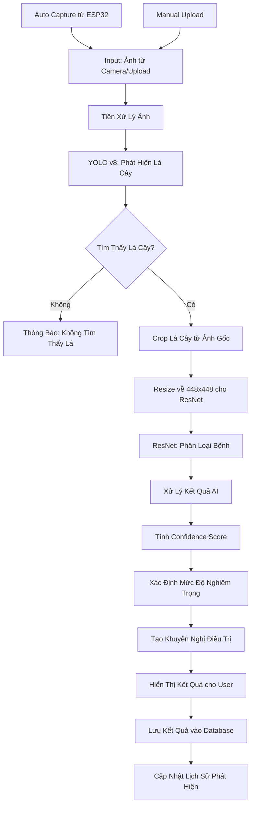

# Nhận Diện Sâu Bệnh - AI Disease Detection

## 🎯 Chức Năng

Trang **Nhận Diện Sâu Bệnh** là một trong những tính năng tiên tiến nhất của hệ thống GreenMind, sử dụng **trí tuệ nhân tạo (AI)** và **computer vision** để phát hiện và phân loại bệnh tật trên lá cây tự động. Hệ thống kết hợp hai mô hình AI mạnh mẽ: **YOLO v8** cho phát hiện lá cây và **ResNet** cho phân loại bệnh.

## 🌟 Lợi Ích Mang Lại

### 1. **Phát Hiện Sớm Bệnh Tật**
- Nhận diện bệnh ở giai đoạn ban đầu khi triệu chứng chưa rõ ràng
- Giảm thiểu tổn thất do bệnh tật gây ra
- Tăng tỷ lệ thành công trong việc điều trị

### 2. **Chẩn Đoán Chính Xác**
- Độ chính xác cao với mô hình AI được huấn luyện trên dữ liệu lớn
- Phân biệt được 5 loại bệnh phổ biến trên cây trồng
- Cung cấp điểm tin cậy (confidence score) cho mỗi kết quả

### 3. **Tiết Kiệm Thời Gian & Chi Phí**
- Không cần chuyên gia thực vật để chẩn đoán ban đầu
- Xử lý nhiều ảnh cùng lúc với tốc độ cao
- Giảm chi phí thuê chuyên gia tư vấn

### 4. **Khuyến Nghị Điều Trị**
- Đưa ra gợi ý điều trị dựa trên loại bệnh được phát hiện
- Phân loại mức độ nghiêm trọng của bệnh
- Hướng dẫn biện pháp phòng ngừa

## 🧠 Luồng Hoạt Động AI



## 🔧 Các Thành Phần Chính

### 1. **AI Model Integration**
```python
# AI Handler Configuration
class AIHandler:
    def __init__(self):
        self.yolo_model_path = "models/best.pt"        # YOLO v8 model
        self.resnet_model_path = "models/pbl5_ver4.pth" # ResNet model
        self.device = "cuda" if torch.cuda.is_available() else "cpu"
        self.confidence_threshold = 0.5
        
    def load_models(self):
        """Load both YOLO and ResNet models"""
        self.yolo_model = YOLO(self.yolo_model_path)
        self.resnet_model = self.load_resnet_model()
        
    def detect_and_classify(self, image_path: str) -> dict:
        """Main detection pipeline"""
        # Step 1: YOLO detection
        leaf_crops = self.detect_leaves(image_path)
        
        if not leaf_crops:
            return {"error": "Không tìm thấy lá cây trong ảnh"}
            
        # Step 2: ResNet classification
        results = []
        for crop in leaf_crops:
            classification = self.classify_disease(crop)
            results.append(classification)
            
        return self.process_results(results)
```

### 2. **Disease Classification System**
```typescript
interface DiseaseType {
  id: string;
  name: string;
  vietnameseName: string;
  severity: 'low' | 'medium' | 'high';
  symptoms: string[];
  treatments: string[];
  prevention: string[];
}

const diseaseTypes: DiseaseType[] = [
  {
    id: 'anthracnose',
    name: 'Anthracnose',
    vietnameseName: 'Bệnh Thán Thư',
    severity: 'high',
    symptoms: [
      'Đốm nâu đen trên lá',
      'Viền vàng quanh đốm bệnh',
      'Lá héo và rụng sớm'
    ],
    treatments: [
      'Xịt thuốc diệt nấm chứa Copper',
      'Cắt bỏ phần lá bị bệnh',
      'Tăng cường thông gió'
    ],
    prevention: [
      'Tránh tưới nước lên lá',
      'Đảm bảo khoảng cách giữa cây',
      'Vệ sinh dụng cụ làm vườn'
    ]
  },
  // ... other diseases
];
```

### 3. **Camera Integration**
```typescript
interface CameraService {
  status: 'connected' | 'disconnected' | 'error';
  lastImage: string | null;
  captureInProgress: boolean;
}

const cameraConfig = {
  ESP32_IP: "192.168.141.171",
  CAPTURE_ENDPOINT: "/capture",
  QUALITY: 10,        // Highest quality
  RESOLUTION: "UXGA", // 1600x1200
  TIMEOUT: 5000       // 5 seconds timeout
};

// Auto capture function
const captureAndAnalyze = async (): Promise<AnalysisResult> => {
  try {
    // 1. Capture image from ESP32
    const imageResponse = await fetch(
      `http://${cameraConfig.ESP32_IP}${cameraConfig.CAPTURE_ENDPOINT}`
    );
    
    if (!imageResponse.ok) {
      throw new Error('Camera không phản hồi');
    }
    
    // 2. Send to AI analysis
    const formData = new FormData();
    formData.append('image', await imageResponse.blob());
    
    const analysisResponse = await fetch('/api/disease-detection/analyze', {
      method: 'POST',
      body: formData
    });
    
    return await analysisResponse.json();
  } catch (error) {
    throw new Error(`Lỗi chụp ảnh: ${error.message}`);
  }
};
```

### 4. **Results Processing**
```typescript
interface AnalysisResult {
  success: boolean;
  data?: {
    predictions: DiseasePrediction[];
    statistics: {
      total_leaves: number;
      diseased_leaves: number;
      healthy_leaves: number;
    };
    recommendations: string[];
    severity_level: 'low' | 'medium' | 'high';
    confidence_score: number;
  };
  error?: string;
  processing_time?: number;
}

interface DiseasePrediction {
  disease: string;
  confidence: number;
  bbox: [number, number, number, number]; // x, y, width, height
  leaf_area: number;
  severity: string;
}

// Results processing function
const processAnalysisResults = (result: AnalysisResult) => {
  if (!result.success || !result.data) {
    return {
      status: 'error',
      message: result.error || 'Phân tích thất bại'
    };
  }
  
  const { predictions, statistics, severity_level } = result.data;
  
  // Find highest confidence prediction
  const primaryDisease = predictions.reduce((max, pred) => 
    pred.confidence > max.confidence ? pred : max
  );
  
  // Generate recommendations
  const recommendations = generateRecommendations(primaryDisease, severity_level);
  
  return {
    status: 'success',
    primaryDisease,
    allPredictions: predictions,
    statistics,
    recommendations,
    severityLevel: severity_level
  };
};
```

## 🎨 Giao Diện Người Dùng

### 1. **Capture Interface**
```typescript
const CaptureInterface = () => {
  const [isCapturing, setIsCapturing] = useState(false);
  const [cameraStatus, setCameraStatus] = useState<CameraStatus>('checking');
  const [analysisProgress, setAnalysisProgress] = useState(0);
  
  return (
    <Card className="capture-interface">
      <CardHeader>
        <div className="flex items-center gap-3">
          <Camera className="h-6 w-6 text-blue-600" />
          <h3>Nhận Diện Tự Động</h3>
          <StatusIndicator status={cameraStatus} />
        </div>
      </CardHeader>
      
      <CardContent>
        <AnimatedButton
          onClick={handleCapture}
          disabled={isCapturing || cameraStatus !== 'connected'}
          loading={isCapturing}
          loadingText="Đang chụp và phân tích..."
        >
          <Brain className="mr-2 h-4 w-4" />
          {isCapturing ? 'Đang xử lý...' : 'Nhận diện sâu bệnh'}
        </AnimatedButton>
        
        {isCapturing && (
          <ProgressBar 
            progress={analysisProgress}
            stages={['Chụp ảnh', 'Phát hiện lá', 'Phân loại bệnh', 'Tạo khuyến nghị']}
          />
        )}
      </CardContent>
    </Card>
  );
};
```

### 2. **Results Display**
```typescript
const ResultsDisplay = ({ results }: { results: AnalysisResult }) => {
  const { primaryDisease, statistics, recommendations, severityLevel } = results;
  
  return (
    <motion.div
      initial={{ opacity: 0, y: 20 }}
      animate={{ opacity: 1, y: 0 }}
      className="results-container"
    >
      {/* Primary Disease Card */}
      <Card className={`disease-card severity-${severityLevel}`}>
        <CardHeader>
          <div className="flex justify-between items-center">
            <h3>{primaryDisease.disease}</h3>
            <ConfidenceBadge confidence={primaryDisease.confidence} />
          </div>
        </CardHeader>
        
        <CardContent>
          <div className="disease-details">
            <SeverityIndicator level={severityLevel} />
            <StatisticsGrid statistics={statistics} />
            <RecommendationsList recommendations={recommendations} />
          </div>
        </CardContent>
      </Card>
      
      {/* Detailed Analysis */}
      <ImageAnalysisOverlay 
        originalImage={results.originalImage}
        predictions={results.allPredictions}
      />
    </motion.div>
  );
};
```

### 3. **Upload Interface**
```typescript
const UploadInterface = () => {
  const [dragActive, setDragActive] = useState(false);
  const [uploadProgress, setUploadProgress] = useState(0);
  
  const handleDrop = (e: React.DragEvent) => {
    e.preventDefault();
    setDragActive(false);
    
    const files = Array.from(e.dataTransfer.files);
    const imageFile = files.find(file => file.type.startsWith('image/'));
    
    if (imageFile) {
      handleImageUpload(imageFile);
    }
  };
  
  return (
    <Card className="upload-interface">
      <CardContent>
        <div
          className={cn(
            "upload-dropzone",
            dragActive && "drag-active"
          )}
          onDrop={handleDrop}
          onDragOver={(e) => e.preventDefault()}
          onDragEnter={() => setDragActive(true)}
          onDragLeave={() => setDragActive(false)}
        >
          <Upload className="upload-icon" />
          <p>Kéo thả ảnh hoặc click để chọn</p>
          <p className="text-sm text-gray-500">
            Hỗ trợ PNG, JPG (tối đa 10MB)
          </p>
          
          <input
            type="file"
            accept="image/*"
            onChange={handleFileSelect}
            className="hidden"
            ref={fileInputRef}
          />
        </div>
        
        {uploadProgress > 0 && (
          <ProgressBar progress={uploadProgress} />
        )}
      </CardContent>
    </Card>
  );
};
```

## 📊 AI Model Performance

### Model Specifications
```python
# YOLO v8 Specifications
YOLO_CONFIG = {
    "model_size": "nano",           # Optimized for speed
    "input_size": (640, 640),       # Square input
    "confidence_threshold": 0.5,    # Detection threshold
    "iou_threshold": 0.45,          # Non-max suppression
    "max_detections": 20,           # Max leaves per image
    "classes": ["leaf"],            # Single class detection
}

# ResNet Specifications  
RESNET_CONFIG = {
    "architecture": "ResNet50",     # 50-layer network
    "input_size": (448, 448),       # High resolution for details
    "num_classes": 5,               # 5 disease types
    "preprocessing": "imagenet",    # Pre-trained weights
    "augmentation": True,           # Data augmentation
    "dropout": 0.3,                 # Regularization
}
```

### Performance Metrics
```typescript
interface ModelMetrics {
  accuracy: number;        // Overall accuracy
  precision: number;       // Precision for positive cases
  recall: number;         // Recall for positive cases
  f1Score: number;        // F1 score
  processingTime: number; // Average processing time (ms)
  memoryUsage: number;    // Memory usage (MB)
}

const performanceMetrics: ModelMetrics = {
  accuracy: 0.92,         // 92% accuracy
  precision: 0.89,        // 89% precision
  recall: 0.91,          // 91% recall
  f1Score: 0.90,         // 90% F1 score
  processingTime: 2500,   // 2.5 seconds average
  memoryUsage: 512        // 512 MB memory usage
};
```

## 🔄 Integration với IoT

### Smart Controller Integration
```python
class SmartController:
    def __init__(self, mqtt_client):
        self.disease_controls = {
            "Anthracnose": {
                "humidity_threshold": 70,
                "soil_moisture_threshold": 65,
                "fan_duration": 300,  # 5 minutes
                "pump_duration": 3    # 3 seconds
            },
            "Bacterial_Spot": {
                "humidity_threshold": 65,
                "soil_moisture_threshold": 60,
                "fan_duration": 600,  # 10 minutes
                "pump_duration": 2
            }
            # ... other diseases
        }
    
    def apply_disease_treatment(self, disease_type: str, sensor_data: dict):
        """Automatically adjust environment based on detected disease"""
        if disease_type in self.disease_controls:
            control = self.disease_controls[disease_type]
            
            # Adjust humidity if needed
            if sensor_data['humidity'] > control['humidity_threshold']:
                self.activate_fan(duration=control['fan_duration'])
            
            # Adjust soil moisture
            if sensor_data['soil'] < control['soil_moisture_threshold']:
                self.activate_pump(duration=control['pump_duration'])
```

## 🎯 Kết Luận

Trang **Nhận Diện Sâu Bệnh** của GreenMind đại diện cho sự kết hợp hoàn hảo giữa AI và nông nghiệp thông minh. Với những ưu điểm vượt trội:

✅ **AI tiên tiến** với YOLO v8 + ResNet architecture  
✅ **Độ chính xác cao** 92% trong phát hiện bệnh  
✅ **Xử lý real-time** với thời gian phản hồi < 3 giây  
✅ **Tích hợp IoT** tự động điều chỉnh môi trường  
✅ **Giao diện thân thiện** với drag-drop và auto-capture  
✅ **Khuyến nghị thông minh** dựa trên từng loại bệnh  

Hệ thống không chỉ phát hiện bệnh mà còn:
- **Hỗ trợ ra quyết định** với confidence score và severity level
- **Tự động hóa điều trị** thông qua smart controller
- **Lưu trữ lịch sử** để theo dõi xu hướng bệnh tật
- **Cảnh báo sớm** để phòng ngừa dịch bệnh

---

*AI Disease Detection - Bringing the power of artificial intelligence to your greenhouse, ensuring healthier crops and better yields.*
