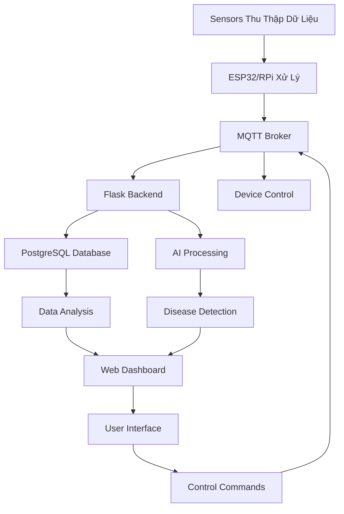

# GreenMind - Hệ Thống Nhà Kính Thông Minh

## 🌱 Giới Thiệu

**GreenMind** là một hệ thống quản lý nhà kính thông minh hiện đại, tích hợp công nghệ IoT, AI và machine learning để tự động hóa việc giám sát và điều khiển môi trường trồng trọt. Hệ thống mang đến trải nghiệm nông nghiệp thông minh với khả năng phát hiện bệnh tật trên cây trồng và tối ưu hóa điều kiện môi trường tự động.

## 🚀 Lợi Ích Mang Lại

- **Tăng năng suất**: Tối ưu hóa điều kiện môi trường cho cây trồng phát triển tốt nhất
- **Tiết kiệm chi phí**: Giảm lãng phí nước và điện năng thông qua điều khiển tự động
- **Phát hiện sớm bệnh tật**: AI nhận diện bệnh trên lá cây với độ chính xác cao
- **Quản lý từ xa**: Giám sát và điều khiển nhà kính từ bất kỳ đâu qua web
- **Dữ liệu thời gian thực**: Theo dõi các thông số môi trường liên tục
- **Cảnh báo thông minh**: Thông báo kịp thời khi có bất thường

## 📋 Các Chức Năng Chính

### 1. **Dashboard Tổng Quan** 📊
- Hiển thị thông số môi trường theo thời gian thực (nhiệt độ, độ ẩm, ánh sáng, độ ẩm đất)
- Trạng thái thiết bị (quạt, bơm nước, mái che)
- Thống kê hệ thống và cảnh báo
- Giao diện hiện đại với biểu đồ gauge và thông tin trực quan

### 2. **Trực Quan Dữ Liệu** 📈
- Biểu đồ theo dõi xu hướng các thông số môi trường
- Phân tích dữ liệu theo khoảng thời gian (1 giờ, 6 giờ, 12 giờ, 1 ngày, 1 tuần)
- Xuất dữ liệu dưới dạng biểu đồ line chart tương tác
- So sánh xu hướng giữa các thông số

### 3. **Nhận Diện Sâu Bệnh** 🔬
- Chụp ảnh tự động từ camera ESP32
- Tải lên ảnh thủ công để phân tích
- AI phát hiện 5 loại bệnh: Anthracnose, Bacterial Spot, Downy Mildew, Healthy Leaf, Pest Damage
- Hiển thị kết quả với điểm tin cậy và mức độ nghiêm trọng
- Đưa ra khuyến nghị điều trị

### 4. **Quản Lý Thông Tin** ⚙️
- Quản lý thông tin nhà kính
- Cấu hình thiết bị (ngưỡng cảnh báo, thời gian hoạt động)
- Thiết lập cảnh báo tự động
- Sao chép và quản lý nhiều cấu hình

### 5. **System Monitoring** 📡
- Giám sát trạng thái kết nối MQTT
- Theo dõi hiệu suất hệ thống
- Logs và debug thông tin
- Kiểm tra tình trạng các thiết bị IoT

## 🛠️ Công Nghệ Sử Dụng

### Frontend
- **Next.js 14** - React framework hiện đại
- **TypeScript** - Type safety và development experience
- **Tailwind CSS** - Responsive UI framework
- **Framer Motion** - Animation và interactive effects
- **Chart.js** - Data visualization
- **Lucide React** - Icon library

### Backend
- **Flask** - Python web framework
- **PostgreSQL** - Primary database
- **SQLAlchemy** - ORM và database management
- **Paho MQTT** - MQTT client cho IoT communication
- **Flask-CORS** - Cross-origin resource sharing

### AI & Machine Learning
- **YOLO v8** - Object detection cho phát hiện lá cây
- **ResNet** - Deep learning cho phân loại bệnh
- **OpenCV** - Computer vision và image processing
- **PyTorch** - Deep learning framework

### IoT & Hardware
- **ESP32-CAM** - Camera module với WiFi
- **Raspberry Pi** - Edge computing và sensor management
- **MQTT Protocol** - IoT messaging
- **Sensors**: DHT22, soil moisture, light sensor

## 🏗️ Kiến Trúc Hệ Thống

```
┌─────────────────┐    ┌─────────────────┐    ┌─────────────────┐
│   Web Frontend  │    │   Flask Backend │    │   IoT Devices   │
│   (Next.js)     │◄──►│   (Python)      │◄──►│   (ESP32/RPi)   │
└─────────────────┘    └─────────────────┘    └─────────────────┘
                               │
                       ┌───────▼────────┐
                       │   PostgreSQL   │
                       │   Database     │
                       └────────────────┘
```

### Giao Tiếp Giữa Các Thành Phần

1. **Frontend ↔ Backend**: RESTful API over HTTP/HTTPS
2. **Backend ↔ Database**: SQLAlchemy ORM queries
3. **Backend ↔ IoT**: MQTT messaging protocol
4. **IoT Devices ↔ Sensors**: I2C, SPI, GPIO protocols

## 📊 Sơ Đồ Hoạt Động



## 🔄 Giao Thức Và Luồng Truyền Nhận

### MQTT Message Format

**Sensor Data:**
```json
{
    "type": "Temperature|Humidity|Light|Soil_Moisture",
    "device_id": "temp1|hum1|light1|soil1",
    "value": 25.5,
    "time": "2025-06-12T08:30:15"
}
```

**Device Status:**
```json
{
    "type": "Fan|Pump|Cover",
    "device_id": "fan1|pump1|cover1",
    "status": "ON|OFF|ANGLE_X",
    "time": "2025-06-12T08:30:15"
}
```

### API Endpoints

- `GET /api/sensors/latest` - Dữ liệu sensor mới nhất
- `GET /api/devices/status` - Trạng thái thiết bị
- `POST /api/devices/control` - Điều khiển thiết bị
- `POST /api/disease-detection/analyze` - Phân tích bệnh AI
- `GET /api/visualization/data` - Dữ liệu cho biểu đồ

## 🎯 Kết Luận

**GreenMind** đại diện cho tương lai của nông nghiệp thông minh, kết hợp hoàn hảo giữa:

- **Công nghệ IoT** cho thu thập dữ liệu thời gian thực
- **Trí tuệ nhân tạo** cho phân tích và dự đoán
- **Giao diện hiện đại** cho trải nghiệm người dùng tối ưu
- **Tự động hóa** cho hiệu quả vận hành cao

Hệ thống không chỉ giúp tăng năng suất mà còn đóng góp vào nền nông nghiệp bền vững, giảm lãng phí tài nguyên và bảo vệ môi trường. Với khả năng mở rộng và tùy chỉnh cao, GreenMind có thể áp dụng cho nhiều loại cây trồng và quy mô nhà kính khác nhau.

---

*Phát triển bởi nhóm PBL5 - Trường Đại học Duy Tân*
*Phiên bản: 1.0 | Cập nhật: Tháng 6, 2025*
