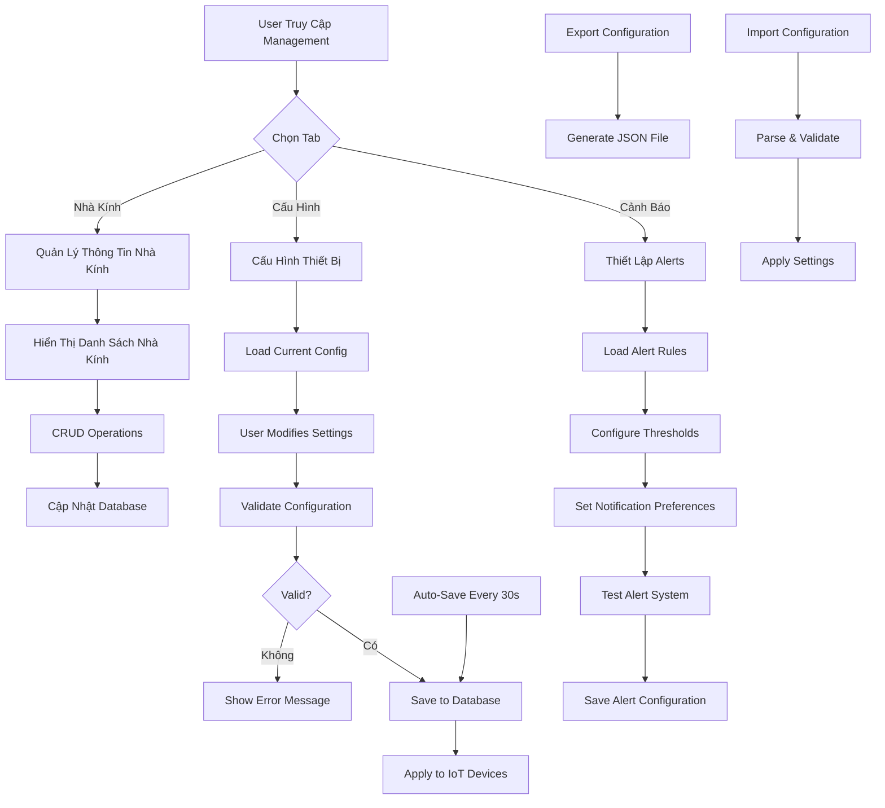

# Quản Lý Thông Tin - Management System

## 🎯 Chức Năng

Trang **Quản Lý Thông Tin** là trung tâm điều hành và cấu hình của hệ thống GreenMind, cho phép người dùng quản lý toàn diện thông tin nhà kính, cấu hình thiết bị và thiết lập hệ thống cảnh báo. Đây là nơi người dùng có thể tùy chỉnh và tối ưu hóa hệ thống theo nhu cầu cụ thể của từng loại cây trồng và điều kiện môi trường.

## 🌟 Lợi Ích Mang Lại

### 1. **Quản Lý Tập Trung**
- Điều khiển tất cả thông tin nhà kính từ một giao diện duy nhất
- Dễ dàng cập nhật và chỉnh sửa thông tin cơ bản
- Theo dõi lịch sử thay đổi và cấu hình

### 2. **Tùy Chỉnh Linh Hoạt**
- Cấu hình ngưỡng cảnh báo theo từng loại cây trồng
- Thiết lập thời gian hoạt động thiết bị tối ưu
- Tạo multiple profiles cho các điều kiện khác nhau

### 3. **Tự Động Hóa Thông Minh**
- Cảnh báo tự động khi vượt ngưỡng an toàn
- Điều khiển thiết bị dựa trên rule-based system
- Lập lịch hoạt động theo chu kỳ định trước

### 4. **Backup & Recovery**
- Sao chép cấu hình giữa các nhà kính
- Xuất/nhập cấu hình dưới dạng file
- Khôi phục cài đặt về mặc định

## 📊 Luồng Hoạt Động



## 🔧 Các Thành Phần Chính

### 1. **Greenhouse Management Tab**
```typescript
interface GreenhouseInfo {
  id: string;
  name: string;
  area: number;              // Diện tích (m²)
  location: string;          // Vị trí
  cropType: string;          // Loại cây trồng
  installDate: Date;         // Ngày lắp đặt
  description?: string;      // Mô tả thêm
  isActive: boolean;         // Trạng thái hoạt động
}

const greenhouseManagement = {
  operations: ['create', 'read', 'update', 'delete'],
  validation: {
    name: { required: true, minLength: 3, maxLength: 50 },
    area: { required: true, min: 1, max: 10000 },
    location: { required: true, minLength: 5 },
    cropType: { required: true, enum: ['rau xanh', 'cây ăn quả', 'hoa', 'dược liệu'] }
  },
  features: [
    'Thêm/sửa/xóa thông tin nhà kính',
    'Tìm kiếm và lọc danh sách',
    'Xuất báo cáo thống kê',
    'Sao chép cấu hình giữa các nhà kính'
  ]
};
```

### 2. **Device Configuration Tab**
```typescript
interface DeviceConfig {
  deviceId: string;
  deviceName: string;
  thresholds: {
    temperature: {
      min: number;           // Ngưỡng tối thiểu
      max: number;           // Ngưỡng tối đa
      optimalMin: number;    // Vùng tối ưu
      optimalMax: number;
    };
    humidity: {
      min: number;
      max: number;
      optimalMin: number;
      optimalMax: number;
    };
    soilMoisture: {
      min: number;
      max: number;
      optimalMin: number;
      optimalMax: number;
    };
    light: {
      min: number;
      max: number;
      optimalMin: number;
      optimalMax: number;
    };
  };
  automationRules: {
    fan: {
      enabled: boolean;
      triggerConditions: string[];  // ['humidity > 80', 'temperature > 30']
      duration: number;             // Thời gian hoạt động (giây)
      cooldown: number;            // Thời gian nghỉ giữa các lần kích hoạt
    };
    pump: {
      enabled: boolean;
      triggerConditions: string[];
      duration: number;
      cooldown: number;
    };
    cover: {
      enabled: boolean;
      lightThreshold: number;      // Ngưỡng ánh sáng để đóng/mở
      angle: number;               // Góc đóng mở (0-150°)
    };
  };
}

// Predefined configurations for different crop types
const cropConfigurations = {
  'rau_xanh': {
    name: 'Rau Xanh',
    temperature: { min: 18, max: 28, optimalMin: 22, optimalMax: 25 },
    humidity: { min: 60, max: 80, optimalMin: 65, optimalMax: 75 },
    soilMoisture: { min: 40, max: 80, optimalMin: 50, optimalMax: 70 },
    light: { min: 2000, max: 8000, optimalMin: 3000, optimalMax: 6000 }
  },
  'cay_an_qua': {
    name: 'Cây Ăn Quả',
    temperature: { min: 20, max: 32, optimalMin: 24, optimalMax: 28 },
    humidity: { min: 55, max: 75, optimalMin: 60, optimalMax: 70 },
    soilMoisture: { min: 35, max: 75, optimalMin: 45, optimalMax: 65 },
    light: { min: 3000, max: 12000, optimalMin: 5000, optimalMax: 10000 }
  }
};
```

### 3. **Alert Configuration Tab**
```typescript
interface AlertRule {
  id: string;
  name: string;
  description: string;
  enabled: boolean;
  conditions: AlertCondition[];
  actions: AlertAction[];
  schedule?: {
    enabled: boolean;
    startTime: string;       // 'HH:mm'
    endTime: string;         // 'HH:mm'
    days: number[];          // [1,2,3,4,5,6,7] for Mon-Sun
  };
  cooldown: number;          // Thời gian giữa các cảnh báo (phút)
  priority: 'low' | 'medium' | 'high' | 'critical';
}

interface AlertCondition {
  parameter: 'temperature' | 'humidity' | 'soilMoisture' | 'light';
  operator: '>' | '<' | '=' | '>=' | '<=';
  value: number;
  duration?: number;         // Thời gian duy trì điều kiện (phút)
}

interface AlertAction {
  type: 'notification' | 'email' | 'sms' | 'device_control';
  config: {
    message?: string;
    recipients?: string[];
    deviceAction?: {
      deviceType: 'fan' | 'pump' | 'cover';
      action: 'on' | 'off' | 'toggle';
      duration?: number;
    };
  };
}

// Example alert rules
const defaultAlertRules: AlertRule[] = [
  {
    id: 'high_temperature',
    name: 'Nhiệt Độ Quá Cao',
    description: 'Cảnh báo khi nhiệt độ vượt 35°C trong 5 phút',
    enabled: true,
    conditions: [
      { parameter: 'temperature', operator: '>', value: 35, duration: 5 }
    ],
    actions: [
      {
        type: 'notification',
        config: { message: 'Nhiệt độ nhà kính quá cao! Cần kiểm tra hệ thống làm mát.' }
      },
      {
        type: 'device_control',
        config: {
          deviceAction: { deviceType: 'fan', action: 'on', duration: 600 }
        }
      }
    ],
    cooldown: 15,
    priority: 'high'
  }
];
```

## 🎨 Giao Diện Người Dùng

### 1. **Tabbed Interface**
```typescript
const ManagementTabs = () => {
  const [activeTab, setActiveTab] = useState('greenhouses');
  
  return (
    <Tabs value={activeTab} onValueChange={setActiveTab}>
      <TabsList className="grid w-full grid-cols-3">
        <TabsTrigger value="greenhouses">
          <Building className="mr-2 h-4 w-4" />
          Nhà kính
        </TabsTrigger>
        <TabsTrigger value="device-config">
          <Settings className="mr-2 h-4 w-4" />
          Cấu hình thiết bị
        </TabsTrigger>
        <TabsTrigger value="alerts">
          <AlertTriangle className="mr-2 h-4 w-4" />
          Cảnh báo
        </TabsTrigger>
      </TabsList>
      
      <TabsContent value="greenhouses">
        <GreenhouseManagement />
      </TabsContent>
      
      <TabsContent value="device-config">
        <DeviceConfiguration />
      </TabsContent>
      
      <TabsContent value="alerts">
        <AlertConfiguration />
      </TabsContent>
    </Tabs>
  );
};
```

### 2. **Configuration Forms**
```typescript
const DeviceConfigForm = ({ config, onChange }: ConfigFormProps) => {
  const [localConfig, setLocalConfig] = useState(config);
  const [isDirty, setIsDirty] = useState(false);
  
  const handleSliderChange = (parameter: string, field: string, value: number) => {
    const newConfig = {
      ...localConfig,
      thresholds: {
        ...localConfig.thresholds,
        [parameter]: {
          ...localConfig.thresholds[parameter],
          [field]: value
        }
      }
    };
    
    setLocalConfig(newConfig);
    setIsDirty(true);
    onChange(newConfig);
  };
  
  return (
    <Card className="config-form">
      <CardHeader>
        <CardTitle>Cấu Hình Ngưỡng Sensor</CardTitle>
        <div className="flex gap-2">
          <PresetSelector onSelect={handlePresetSelect} />
          <Button variant="outline" onClick={resetToDefault}>
            <RotateCcw className="mr-2 h-4 w-4" />
            Đặt lại
          </Button>
        </div>
      </CardHeader>
      
      <CardContent>
        {Object.entries(localConfig.thresholds).map(([parameter, values]) => (
          <ParameterConfig
            key={parameter}
            parameter={parameter}
            values={values}
            onChange={(field, value) => handleSliderChange(parameter, field, value)}
          />
        ))}
        
        <AutoSaveIndicator isDirty={isDirty} lastSaved={lastSavedTime} />
      </CardContent>
    </Card>
  );
};
```

### 3. **Alert Rule Builder**
```typescript
const AlertRuleBuilder = () => {
  const [rule, setRule] = useState<AlertRule>(createEmptyRule());
  const [testMode, setTestMode] = useState(false);
  
  const addCondition = () => {
    setRule(prev => ({
      ...prev,
      conditions: [...prev.conditions, createEmptyCondition()]
    }));
  };
  
  const updateCondition = (index: number, condition: AlertCondition) => {
    setRule(prev => ({
      ...prev,
      conditions: prev.conditions.map((c, i) => i === index ? condition : c)
    }));
  };
  
  const testRule = async () => {
    setTestMode(true);
    try {
      const result = await testAlertRule(rule);
      showToast(result.success ? 'Test thành công!' : 'Test thất bại', result.success ? 'success' : 'error');
    } catch (error) {
      showToast('Lỗi khi test rule', 'error');
    } finally {
      setTestMode(false);
    }
  };
  
  return (
    <Card className="rule-builder">
      <CardHeader>
        <div className="flex justify-between items-center">
          <CardTitle>Tạo Rule Cảnh Báo</CardTitle>
          <div className="flex gap-2">
            <Button variant="outline" onClick={testRule} disabled={testMode}>
              {testMode ? <Loader2 className="mr-2 h-4 w-4 animate-spin" /> : <Play className="mr-2 h-4 w-4" />}
              Test Rule
            </Button>
            <Button onClick={saveRule}>
              <Save className="mr-2 h-4 w-4" />
              Lưu
            </Button>
          </div>
        </div>
      </CardHeader>
      
      <CardContent>
        <div className="space-y-6">
          <RuleBasicInfo rule={rule} onChange={setRule} />
          <ConditionsBuilder 
            conditions={rule.conditions}
            onAdd={addCondition}
            onUpdate={updateCondition}
            onRemove={removeCondition}
          />
          <ActionsBuilder
            actions={rule.actions}
            onAdd={addAction}
            onUpdate={updateAction}
            onRemove={removeAction}
          />
          <ScheduleBuilder
            schedule={rule.schedule}
            onChange={updateSchedule}
          />
        </div>
      </CardContent>
    </Card>
  );
};
```

## 🔄 Data Management

### Configuration Persistence
```typescript
// Auto-save functionality
const useAutoSave = <T>(data: T, saveFunction: (data: T) => Promise<void>) => {
  const [isDirty, setIsDirty] = useState(false);
  const [lastSaved, setLastSaved] = useState<Date | null>(null);
  
  useEffect(() => {
    if (!isDirty) return;
    
    const timer = setTimeout(async () => {
      try {
        await saveFunction(data);
        setLastSaved(new Date());
        setIsDirty(false);
        showToast('Cấu hình đã được lưu tự động', 'success');
      } catch (error) {
        showToast('Lỗi khi lưu cấu hình', 'error');
      }
    }, 30000); // Auto-save after 30 seconds
    
    return () => clearTimeout(timer);
  }, [data, isDirty, saveFunction]);
  
  return { isDirty, lastSaved, markDirty: () => setIsDirty(true) };
};

// Configuration export/import
const exportConfiguration = (config: DeviceConfig) => {
  const exportData = {
    version: '1.0',
    timestamp: new Date().toISOString(),
    configuration: config,
    metadata: {
      greenhouse: getCurrentGreenhouse(),
      exportedBy: getCurrentUser()
    }
  };
  
  const blob = new Blob([JSON.stringify(exportData, null, 2)], {
    type: 'application/json'
  });
  
  const url = URL.createObjectURL(blob);
  const link = document.createElement('a');
  link.href = url;
  link.download = `greenhouse-config-${Date.now()}.json`;
  link.click();
  
  URL.revokeObjectURL(url);
};

const importConfiguration = async (file: File): Promise<DeviceConfig> => {
  return new Promise((resolve, reject) => {
    const reader = new FileReader();
    
    reader.onload = (e) => {
      try {
        const data = JSON.parse(e.target?.result as string);
        
        // Validate structure
        if (!data.configuration || !data.version) {
          throw new Error('Invalid configuration file format');
        }
        
        // Version compatibility check
        if (data.version !== '1.0') {
          throw new Error('Unsupported configuration version');
        }
        
        resolve(data.configuration);
      } catch (error) {
        reject(new Error('Failed to parse configuration file'));
      }
    };
    
    reader.onerror = () => reject(new Error('Failed to read file'));
    reader.readAsText(file);
  });
};
```

### Validation System
```typescript
const configValidation = {
  thresholds: {
    temperature: { min: -10, max: 60 },
    humidity: { min: 0, max: 100 },
    soilMoisture: { min: 0, max: 100 },
    light: { min: 0, max: 100000 }
  },
  
  validateConfig: (config: DeviceConfig): ValidationResult => {
    const errors: string[] = [];
    
    Object.entries(config.thresholds).forEach(([param, values]) => {
      const limits = configValidation.thresholds[param];
      
      if (values.min < limits.min || values.max > limits.max) {
        errors.push(`${param}: Giá trị ngoài phạm vi cho phép`);
      }
      
      if (values.min >= values.max) {
        errors.push(`${param}: Giá trị min phải nhỏ hơn max`);
      }
      
      if (values.optimalMin < values.min || values.optimalMax > values.max) {
        errors.push(`${param}: Vùng tối ưu nằm ngoài phạm vi min-max`);
      }
    });
    
    return {
      isValid: errors.length === 0,
      errors
    };
  }
};
```

## 🎯 Kết Luận

Trang **Quản Lý Thông Tin** của GreenMind là **trung tâm điều hành** hoàn chỉnh cho hệ thống nhà kính thông minh. Với thiết kế modular và tính năng toàn diện:

✅ **Quản lý tập trung** tất cả thông tin và cấu hình  
✅ **Giao diện trực quan** với tabbed interface và form validation  
✅ **Auto-save intelligent** tránh mất dữ liệu  
✅ **Import/Export** cấu hình dễ dàng  
✅ **Alert system** linh hoạt với rule builder  
✅ **Validation mạnh mẽ** đảm bảo tính nhất quán  

Trang này giúp người dùng:
- **Tùy chỉnh hệ thống** theo nhu cầu cụ thể
- **Tự động hóa** các tác vụ thường xuyên
- **Giám sát proactive** với system alerts
- **Backup & restore** cấu hình an toàn
- **Scale up** dễ dàng khi mở rộng hệ thống

---

*Management System - Where control meets intelligence, enabling you to orchestrate your smart greenhouse with precision and confidence.*
