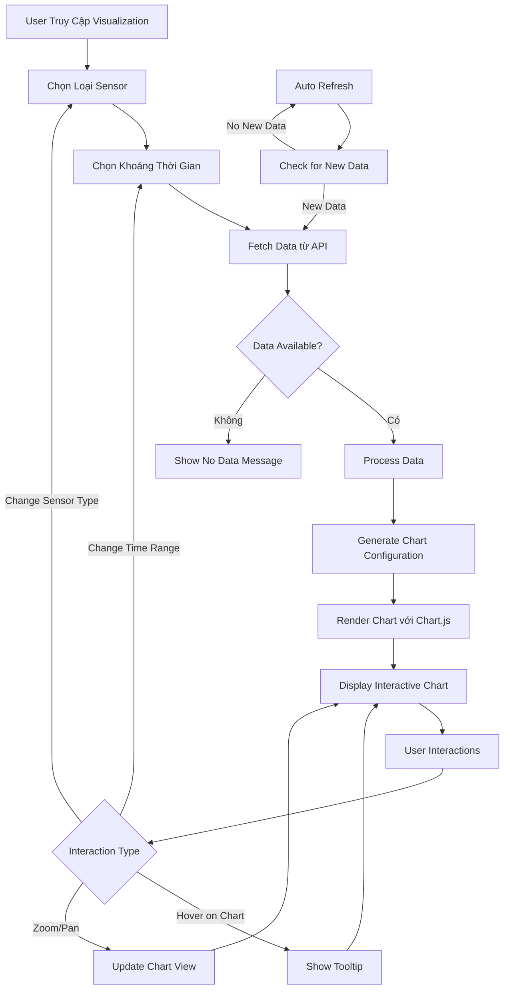

# Trực Quan Dữ Liệu - Data Visualization

## 🎯 Chức Năng

Trang **Trực Quan Dữ Liệu** là công cụ phân tích chuyên sâu cho phép người dùng khám phá xu hướng, mẫu hình và biến đổi của các thông số môi trường trong nhà kính theo thời gian. Trang này chuyển đổi dữ liệu thô thành những biểu đồ trực quan, dễ hiểu và có thể hành động được.

## 🌟 Lợi Ích Mang Lại

### 1. **Phân Tích Xu Hướng Dài Hạn**
- Theo dõi sự biến đổi của các thông số qua thời gian
- Phát hiện các mẫu hình định kỳ (ngày/đêm, theo mùa)
- Dự đoán xu hướng tương lai dựa trên dữ liệu lịch sử

### 2. **Ra Quyết Định Dựa Trên Dữ Liệu**
- Tối ưu hóa điều kiện môi trường dựa trên biểu đồ
- Xác định thời điểm tốt nhất cho các hoạt động chăm sóc cây
- Điều chỉnh cấu hình thiết bị dựa trên phân tích

### 3. **Giám Sát Hiệu Suất Hệ Thống**
- Đánh giá hiệu quả của các thiết bị điều khiển
- Phát hiện sự bất thường trong quá trình hoạt động
- Tối ưu hóa chu kỳ làm việc của thiết bị

### 4. **Báo Cáo Và Thống Kê**
- Tạo báo cáo chi tiết về tình hình môi trường
- So sánh hiệu suất giữa các khoảng thời gian
- Xuất dữ liệu cho mục đích nghiên cứu

## 📊 Luồng Hoạt Động



## 🔧 Các Thành Phần Chính

### 1. **Sensor Type Selector**
```typescript
interface SensorType {
  id: string;
  name: string;
  unit: string;
  color: string;
  icon: ReactNode;
}

const sensorTypes: SensorType[] = [
  {
    id: 'temperature',
    name: 'Nhiệt Độ',
    unit: '°C',
    color: '#ef4444',
    icon: <Thermometer />
  },
  {
    id: 'humidity',
    name: 'Độ Ẩm Không Khí',
    unit: '%',
    color: '#3b82f6',
    icon: <Droplets />
  },
  {
    id: 'soil',
    name: 'Độ Ẩm Đất',
    unit: '%',
    color: '#8b5cf6',
    icon: <Sprout />
  },
  {
    id: 'light',
    name: 'Cường Độ Ánh Sáng',
    unit: 'lux',
    color: '#f59e0b',
    icon: <Sun />
  }
];
```

### 2. **Time Range Selector**
```typescript
interface TimeRange {
  label: string;
  value: string;
  hours: number;
  description: string;
}

const timeRanges: TimeRange[] = [
  { 
    label: '1 Giờ', 
    value: '1h', 
    hours: 1,
    description: 'Dữ liệu thời gian thực trong 1 giờ qua'
  },
  { 
    label: '6 Giờ', 
    value: '6h', 
    hours: 6,
    description: 'Xu hướng ngắn hạn trong 6 giờ'
  },
  { 
    label: '12 Giờ', 
    value: '12h', 
    hours: 12,
    description: 'Biến đổi trong nửa ngày'
  },
  { 
    label: '1 Ngày', 
    value: '24h', 
    hours: 24,
    description: 'Chu kỳ ngày/đêm hoàn chỉnh'
  },
  { 
    label: '1 Tuần', 
    value: '7d', 
    hours: 168,
    description: 'Xu hướng dài hạn trong tuần'
  }
];
```

### 3. **Chart Configuration**
```typescript
interface ChartConfig {
  type: 'line';
  data: {
    labels: string[];           // Timestamps
    datasets: ChartDataset[];   // Sensor data series
  };
  options: {
    responsive: boolean;
    maintainAspectRatio: boolean;
    interaction: InteractionOptions;
    scales: ScaleOptions;
    plugins: PluginOptions;
  };
}

interface ChartDataset {
  label: string;              // Tên sensor
  data: number[];             // Giá trị sensor
  borderColor: string;        // Màu đường
  backgroundColor: string;    // Màu nền (gradient)
  tension: number;           // Độ cong đường
  pointRadius: number;       // Kích thước điểm
  pointHoverRadius: number;  // Kích thước điểm khi hover
}
```

### 4. **Data Processing Pipeline**
```typescript
interface VisualizationData {
  timestamp: string;
  temperature?: number;
  humidity?: number;
  soil_moisture?: number;
  light_intensity?: number;
}

// Data processing functions
const processVisualizationData = (
  rawData: VisualizationData[],
  sensorType: string,
  timeRange: string
) => {
  // 1. Filter data by time range
  const filteredData = filterByTimeRange(rawData, timeRange);
  
  // 2. Aggregate data for large time ranges
  const aggregatedData = aggregateData(filteredData, timeRange);
  
  // 3. Handle missing values
  const cleanedData = interpolateMissingValues(aggregatedData);
  
  // 4. Format for chart consumption
  return formatForChart(cleanedData, sensorType);
};
```

## 📈 Advanced Chart Features

### 1. **Interactive Tooltips**
```typescript
const tooltipConfig = {
  mode: 'index',
  intersect: false,
  backgroundColor: 'rgba(0, 0, 0, 0.8)',
  titleColor: '#ffffff',
  bodyColor: '#ffffff',
  borderColor: '#374151',
  borderWidth: 1,
  cornerRadius: 8,
  displayColors: true,
  callbacks: {
    title: (context) => {
      return formatDateTime(context[0].label);
    },
    label: (context) => {
      const value = context.parsed.y;
      const unit = getSensorUnit(context.dataset.label);
      return `${context.dataset.label}: ${value.toFixed(1)}${unit}`;
    },
    afterBody: (context) => {
      return getOptimalRangeInfo(context[0].dataset.label);
    }
  }
};
```

### 2. **Responsive Scaling**
```typescript
const scaleConfig = {
  x: {
    type: 'time',
    time: {
      displayFormats: {
        hour: 'HH:mm',
        day: 'MM/DD HH:mm',
        week: 'MM/DD'
      }
    },
    grid: {
      color: 'rgba(156, 163, 175, 0.2)'
    },
    ticks: {
      color: '#6b7280',
      maxTicksLimit: 10
    }
  },
  y: {
    beginAtZero: false,
    grid: {
      color: 'rgba(156, 163, 175, 0.2)'
    },
    ticks: {
      color: '#6b7280',
      callback: function(value) {
        return `${value}${getSensorUnit(sensorType)}`;
      }
    }
  }
};
```

### 3. **Performance Optimization**
```typescript
// Memoized chart component để tránh re-render không cần thiết
const MemoizedChart = React.memo(({ data, options }) => {
  return <Line data={data} options={options} />;
}, (prevProps, nextProps) => {
  return JSON.stringify(prevProps.data) === JSON.stringify(nextProps.data);
});

// Debounced data fetching
const debouncedFetchData = useCallback(
  debounce((sensorType: string, timeRange: string) => {
    fetchVisualizationData(sensorType, timeRange);
  }, 300),
  []
);
```

## 🎨 Visual Design System

### Color Palette
```typescript
const sensorColors = {
  temperature: {
    primary: '#ef4444',      // Đỏ - Temperature
    gradient: 'rgba(239, 68, 68, 0.1)',
    hover: '#dc2626'
  },
  humidity: {
    primary: '#3b82f6',      // Xanh dương - Humidity
    gradient: 'rgba(59, 130, 246, 0.1)',
    hover: '#2563eb'
  },
  soil: {
    primary: '#8b5cf6',      // Tím - Soil moisture
    gradient: 'rgba(139, 92, 246, 0.1)',
    hover: '#7c3aed'
  },
  light: {
    primary: '#f59e0b',      // Vàng - Light
    gradient: 'rgba(245, 158, 11, 0.1)',
    hover: '#d97706'
  }
};
```

### Chart Styling
```css
.chart-container {
  background: linear-gradient(145deg, #ffffff 0%, #f8fafc 100%);
  border-radius: 12px;
  box-shadow: 0 4px 6px rgba(0, 0, 0, 0.07);
  padding: 24px;
  margin-bottom: 24px;
}

.chart-header {
  display: flex;
  justify-content: space-between;
  align-items: center;
  margin-bottom: 20px;
}

.chart-title {
  font-size: 1.25rem;
  font-weight: 600;
  color: #1f2937;
  display: flex;
  align-items: center;
  gap: 8px;
}
```

## 📊 Data Analytics Features

### 1. **Statistical Analysis**
```typescript
interface SensorStatistics {
  min: number;
  max: number;
  average: number;
  median: number;
  standardDeviation: number;
  trend: 'increasing' | 'decreasing' | 'stable';
  optimalRange: {
    min: number;
    max: number;
  };
}

const calculateStatistics = (data: number[]): SensorStatistics => {
  const sorted = data.sort((a, b) => a - b);
  const min = Math.min(...data);
  const max = Math.max(...data);
  const average = data.reduce((sum, val) => sum + val, 0) / data.length;
  const median = sorted[Math.floor(sorted.length / 2)];
  
  // Calculate standard deviation
  const variance = data.reduce((sum, val) => sum + Math.pow(val - average, 2), 0) / data.length;
  const standardDeviation = Math.sqrt(variance);
  
  // Determine trend
  const trend = calculateTrend(data);
  
  return {
    min, max, average, median, standardDeviation, trend,
    optimalRange: getOptimalRange(sensorType)
  };
};
```

### 2. **Anomaly Detection**
```typescript
interface Anomaly {
  timestamp: string;
  value: number;
  type: 'spike' | 'drop' | 'outlier';
  severity: 'low' | 'medium' | 'high';
  description: string;
}

const detectAnomalies = (data: VisualizationData[]): Anomaly[] => {
  const anomalies: Anomaly[] = [];
  
  data.forEach((point, index) => {
    // Z-score based detection
    const zScore = calculateZScore(point.value, data);
    if (Math.abs(zScore) > 2.5) {
      anomalies.push({
        timestamp: point.timestamp,
        value: point.value,
        type: zScore > 0 ? 'spike' : 'drop',
        severity: Math.abs(zScore) > 3 ? 'high' : 'medium',
        description: `Giá trị bất thường: ${point.value}`
      });
    }
  });
  
  return anomalies;
};
```

## 🔄 Real-time Updates

### WebSocket Integration
```typescript
// Real-time data streaming
const useRealtimeVisualization = (sensorType: string) => {
  const [data, setData] = useState<VisualizationData[]>([]);
  
  useEffect(() => {
    const ws = new WebSocket('ws://localhost:5000/visualization');
    
    ws.onmessage = (event) => {
      const newData = JSON.parse(event.data);
      setData(prevData => {
        const updated = [...prevData, newData];
        // Keep only last 100 points for performance
        return updated.slice(-100);
      });
    };
    
    return () => ws.close();
  }, [sensorType]);
  
  return data;
};
```

### Progressive Loading
```typescript
// Load data progressively for better UX
const useProgressiveDataLoading = (timeRange: string) => {
  const [isLoading, setIsLoading] = useState(false);
  const [progress, setProgress] = useState(0);
  
  const loadData = async () => {
    setIsLoading(true);
    setProgress(0);
    
    // Load data in chunks
    const chunks = getDataChunks(timeRange);
    for (let i = 0; i < chunks.length; i++) {
      await loadChunk(chunks[i]);
      setProgress((i + 1) / chunks.length * 100);
    }
    
    setIsLoading(false);
  };
  
  return { isLoading, progress, loadData };
};
```

## 🎯 Kết Luận

Trang **Trực Quan Dữ Liệu** của GreenMind là một công cụ phân tích mạnh mẽ, biến đổi dữ liệu thô thành insights có giá trị. Với những tính năng nổi bật:

✅ **Biểu đồ tương tác cao** với Chart.js và animations mượt mà  
✅ **Phân tích thống kê tự động** và phát hiện anomalies  
✅ **Real-time updates** với WebSocket integration  
✅ **Performance tối ưu** với memoization và lazy loading  
✅ **Responsive design** hoạt động tốt trên mọi thiết bị  

Trang này không chỉ hiển thị dữ liệu mà còn giúp người dùng:
- **Hiểu rõ hơn** về môi trường nhà kính
- **Tối ưu hóa** điều kiện trồng trọt
- **Phát hiện sớm** các vấn đề tiềm ẩn
- **Ra quyết định** dựa trên dữ liệu khoa học

---

*Visualization là cầu nối giữa dữ liệu và tri thức, giúp bạn trở thành chuyên gia quản lý nhà kính thông minh.*
